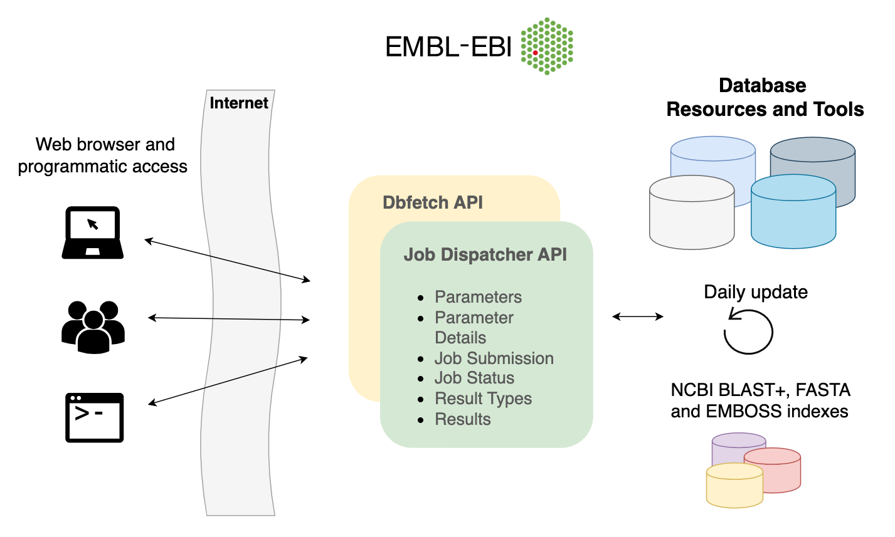

# Welcome to the Job Dispatcher Documentation

## Introduction

[Job Dispatcher](https://wwwdev.ebi.ac.uk/Tools/jdispatcher/home/) provides various bioinformatics tools and 
related biological datasets to the scientific user community.
All our resources can be accessed via the web interface or programmatically. Job Dispatcher also offers
these resources behind the scenes to power several other popular services hosted at the EBI such as 
InterProScan, UniProt, Ensembl Genomes, etc. The team also provides 
[Dbfetch](https://www.ebi.ac.uk/Tools/dbfetch/), an easy way to retrieve 
entries from various databases at the EMBL-EBI in a consistent manner.

<figure markdown>
  { width="800" }
  <figcaption>Overview of the Job Dispatcher services
    accessible via webpage and programmatic interfaces.</figcaption>
</figure>

## What does Job Dispatcher offer

### Bioinformatics tools
Job Dispatcher provides integrated access to core bioinformatics applications.
These include some of the most popular powerhouses in bioinformatics, from sequence similarity search applications, 
such as NCBI BLAST+ and FASTA, multiple sequence alignment and pairwise sequence alignment tools, 
such as Clustal Omega and Kalign, tools for functional annotation and prediction such as InterProScan 5, 
RNA analysis tools such as R2DT, to other sequence analysis utilities. 
Visual representations of tool results, as well as downloadable results files,
are also provided to help the users understand the job outputs.

### Biological datasets
Job Dispatcher provides more than 45,000 distinct sequence libraries from major
database resources hosted at EMBL-EBI, including UniProtKB, ENA and Ensembl Genomes. 
These are available for search through sequence similarity search applications.
These datasets can be retrieved with Dbfetch, which provides a common interface to database entry retrieval 
in a variety of different formats.
Dbfetch provides all the sequence libraries available to search in Job Dispatcher, with addition of 
several metadata datasets, including EMDB, PDBe-KB, MEDLINE, NCBI Taxonomy, EDAM ontology and HGNC.

### Programmatic access to the tools and data
In addition to the webforms available from the website and downloadable results files, 
Job Dispatcher tools and Dbfetch data, can be accessed and retrieved via RESTful APIs, 
giving full programmatic access to the tools and data.
Learn more about this on the [Programmatic access](webservices/) section.

## Training materials

The Job Dispatcher team is involved various training events at EMBL-EBI throughout the year.
See a list of webinars
we delivered as part of [EBI Train online](https://www.ebi.ac.uk/training/online/about-train-online):

- [Webinar about sequence alignment tools](https://www.ebi.ac.uk/training/events/exploring-sequence-alignment-tools-job-dispatcher/)
- [Webinar about sequence similarity search](https://www.ebi.ac.uk/training/events/guide-sequence-similarity-search-biomolecular-sequences/)
- [Webinar about Dbfetch](https://www.ebi.ac.uk/training/events/retrieving-biological-data-embl-ebi-resources-using-dbfetch/)
- [Webinar about Introduction to programmatic access](https://www.ebi.ac.uk/training/online/courses/embl-ebi-programmatically/introduction-to-programmatic-access/)
- [Webinar about sequence analysis web services](https://www.ebi.ac.uk/training/events/bioinformatics-sequence-analysis-web-services-job-dispatcher/)

## News and updates

If you would like to keep up to date with developments within Job Dispatcher,
please follow us on Twitter ([@ebi_jdispatcher](https://twitter.com/ebi_jdispatcher)).

We often write on our team blog so check that out as well at
[https://ebi-jdispatcher.github.io/blog/](https://ebi-jdispatcher.github.io/blog/).

## How to cite

To cite the Job Dispatcher services, please refer to the following publication:

Madeira F., Pearce M., Tivey ARN., Basutkar P., Lee J., Edbali O., Madhusoodanan N., Kolesnikov A., Lopez R. (2022)
**Search and sequence analysis tools services from EMBL-EBI in 2022**.  
*Nucleic Acids Research*, April 12, 2022; doi: [10.1093/nar/gkac240](https://doi.org/10.1093/nar/gkac240);
Europe PMC: [35412617](https://europepmc.org/article/MED/35412617)

## Previous publications

A full list of our previous publications can be found in our [References](references/) page.

## Funding

This work is funded the EMBL-EBI's core funding. 
EMBL-EBI is indebted to its funders, including the EMBL member states and the European Commission 
through the H2020 Programme under EOSC-Life [824087]; BY-COVID [101046203]; EarlyCause [848158].

## Privacy notice

The Job dispatcher services we provide are General Data Protection Regulation (GDPR) compliant,
which means that personal data from users, including email addresses, IPs, and submitted data,
are encrypted and deleted from our servers after seven days.

Programmatic access to Job Dispatcher services requires the user to provide an email address,
which is only used to give tailored support and guidance.
Email is, however, optional for web browser-based usage access to the tools, which is used when
provided by the user to send out a notification about the completion of the submitted jobs.
In accordance with GDPR compliance, emails are not used in any other way nor distributed in any
form outside the EMBL-EBI.

More information on services GDPR compliance is provided on the EMBL-EBI website's
[Terms of Use](https://www.ebi.ac.uk/about/terms-of-use)
and the [Privacy Notice](https://www.ebi.ac.uk/data-protection/privacy-notice/sequence-analysis-and-data-retrieval-tools-job-dispatcher-and-dbfetch-) for Job Dispatcher tools.

## Contact us

Please read the provided Documentation, Privacy and FAQ pages (these pages) before seeking help from our support staff.

If you have any feedback or experienced any issues, please let us
know via [EMBL-EBI Support](https://www.ebi.ac.uk/about/contact/support/webservices).
We aim to respond as quickly as possible!
