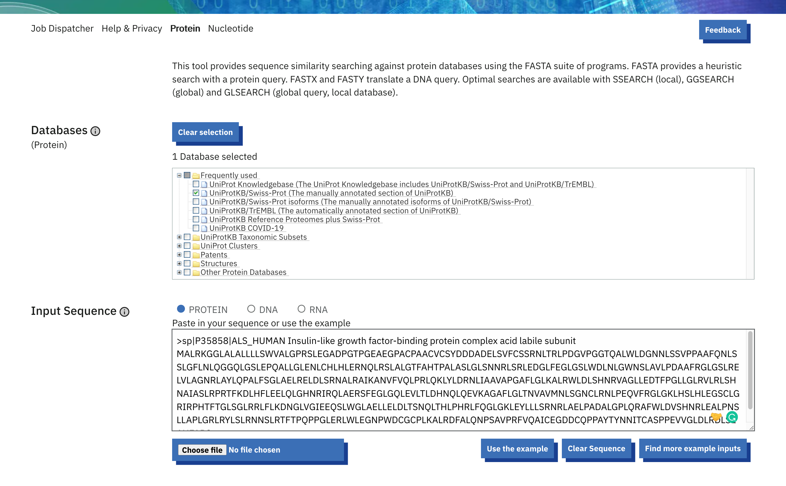
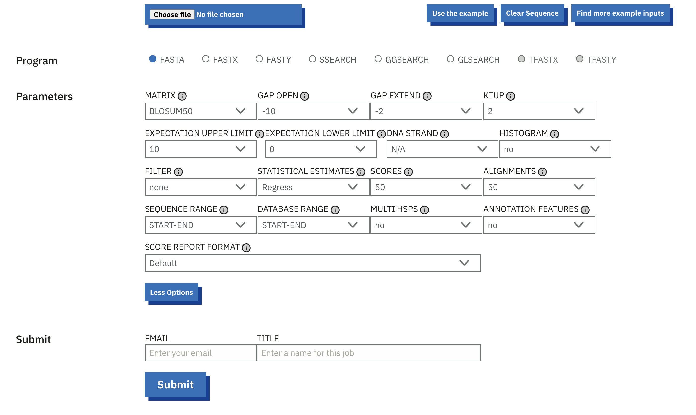

# Getting started with the webforms

From the [Job Dispatcher](https://wwwdev.ebi.ac.uk/Tools/jdispatcher/) homepage, 
browse the available tool categories and click on the tool that
you want to use. 
Alternativey, you can search for tools on the [EMBL-EBI services page](https://www.ebi.ac.uk/services/).
Note that not all the tools listed in the EMBL-EBI services page are provided by Job Dispatcher.

<figure markdown>
  { width="1200" }
  <figcaption>The Job Dispatcher homepage.</figcaption>
</figure>

## Tool webforms

Running a tool from the web form is a simple multiple steps process.
Each tool has at least 2 steps, but most of them have more, based on the tool category:

- The first steps are usually where the user sets the tool input (e.g. provide your input protein/nucleotide sequences, 
specify the databases (in case of sequence similarity search). 
The input sequence should be in one of the tool-specified formats.
You can either paste the sequence or use the file upload option.

<figure markdown>
  { width="1200" }
  <figcaption>An example screenshot of a tool webform.</figcaption>
</figure>

- In the following steps, the user has the possibility to change the default tool parameters. 
Click on ‘More Options’ to see all the parameters for that specific tool. 
Mouse over the parameters to get more information about the parameter and default values.

- And finally, the last step is always the tool submission step, 
where the user can specify a title to be associated with the results and an email address for email notification. 
Using the *submit* button will effectively submit the information
specified previously in the form to launch the tool on the server.

<figure markdown>
  { width="1200" }
  <figcaption>An example screenshot of a tool webform with expanded Parameters.</figcaption>
</figure>

## Input validation

When a job is submitted, the webform performs some basic validation, for example, to check if any
input has been provided. 
Additional validation is performed on the backend server to fully validate the input.

!!! tip

    Parameters are validated by the backend server prior to running the tool on our HPC and in the event 
    of a missing or wrong combination of parameters, the user will be notified directly in the webform. 

In addition to input validation, note that there are input constraints that vary across different tools.
These can be on the number of input sequences, file size, in the case that the input is provided as a 
file upload, as well as the parameter values. 
These usually depend on the context of other parameters, the input provided or the program or database
selected. 
The server validation messages typically provide a good hint on what the issue might be.

!!! warning
    
    There is a file size limit for each tool. If your input sequence exceeds the limit, you will need 
    to download the tool and run it locally.

## Sequence databases

Job Dispatcher provides more than 45,000 distinct sequence libraries from major
database resources hosted at EMBL-EBI, including UniProtKB, ENA and Ensembl Genomes.
These are available for search through sequence similarity search applications.

A complete list of databases provided by Job Dispatcher is provided in the next section [Available databases](/databases).

## Dbfetch

[Dbfetch](https://www.ebi.ac.uk/Tools/dbfetch/) provides a common interface to database entry retrieval 
in a variety of different formats.

Dbfetch provides all the sequence libraries available to search in Job Dispatcher, with addition of
several metadata datasets, including EMDB, PDBe-KB, MEDLINE, NCBI Taxonomy, EDAM ontology and HGNC.

A list of databases available in Dbfetch is provided on the 
[Dbfetch Databases](https://www.ebi.ac.uk/Tools/dbfetch/dbfetch/dbfetch.databases) page.
